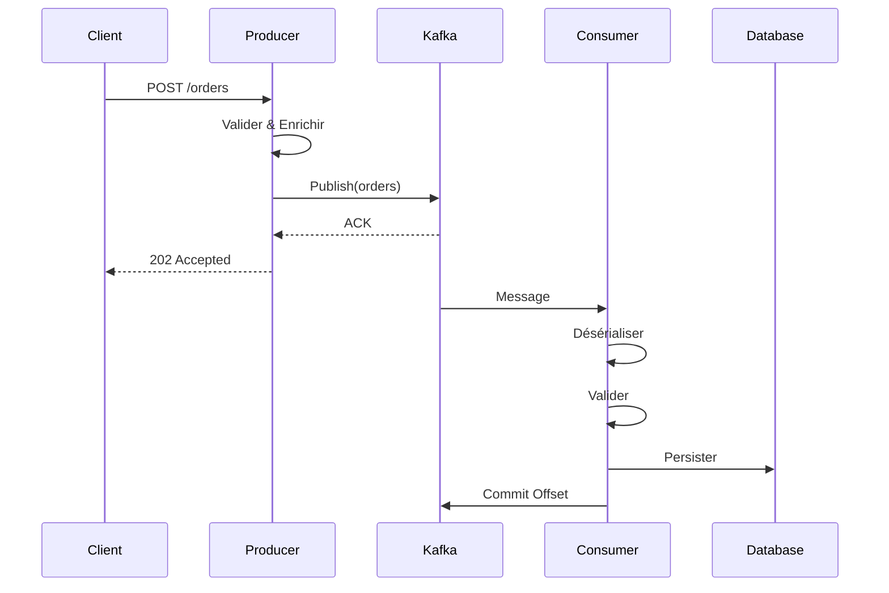
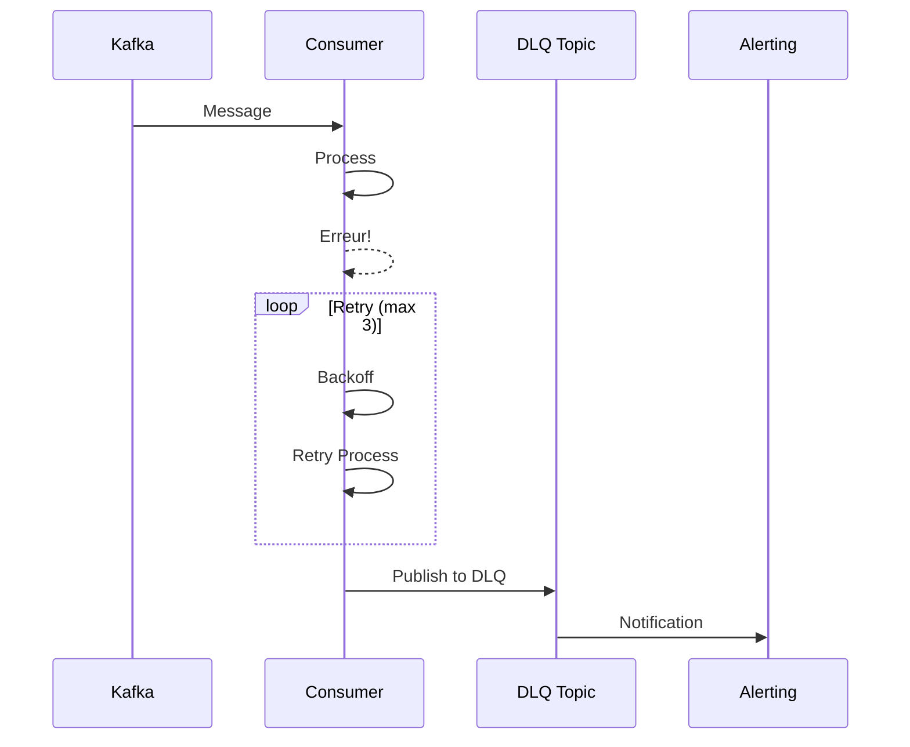

# Architecture PubSubKafka

## Vue d'ensemble

PubSubKafka est un système de messaging basé sur Apache Kafka, implémentant les patterns Pub/Sub et Event-Carried State Transfer (ECST) pour le traitement de commandes e-commerce.

## Diagramme d'Architecture

```
                                    ┌─────────────────────────────────────────────────────────────┐
                                    │                    Monitoring Stack                          │
                                    │  ┌─────────────┐  ┌─────────────┐  ┌─────────────┐          │
                                    │  │  Prometheus │  │   Grafana   │  │   Jaeger    │          │
                                    │  └──────┬──────┘  └──────┬──────┘  └──────┬──────┘          │
                                    │         │                │                │                  │
                                    └─────────┼────────────────┼────────────────┼──────────────────┘
                                              │                │                │
                    ┌─────────────────────────┼────────────────┼────────────────┼──────────────────┐
                    │                         ▼                ▼                ▼                  │
┌───────────┐      │     ┌─────────────────────────────────────────────────────────────────────┐  │
│           │      │     │                           Kubernetes Cluster                         │  │
│  External │      │     │                                                                      │  │
│   Client  │──────┼────▶│  ┌─────────────┐         ┌─────────────┐         ┌─────────────┐    │  │
│           │      │     │  │             │         │             │         │             │    │  │
└───────────┘      │     │  │  Producer   │────────▶│    Kafka    │────────▶│  Consumer   │    │  │
                   │     │  │  Service    │         │   Cluster   │         │  Service    │    │  │
                   │     │  │             │         │             │         │             │    │  │
                   │     │  └─────────────┘         └──────┬──────┘         └──────┬──────┘    │  │
                   │     │                                 │                       │           │  │
                   │     │                                 ▼                       ▼           │  │
                   │     │                          ┌─────────────┐         ┌─────────────┐    │  │
                   │     │                          │   orders    │         │ Event Store │    │  │
                   │     │                          │  orders-dlq │         │ (PostgreSQL)│    │  │
                   │     │                          └─────────────┘         └─────────────┘    │  │
                   │     │                                                                      │  │
                   │     └──────────────────────────────────────────────────────────────────────┘  │
                   │                                                                               │
                   └───────────────────────────────────────────────────────────────────────────────┘
```

## Composants Principaux

### 1. Producer Service

**Responsabilités:**
- Génération d'événements de commande
- Sérialisation des messages (JSON/Protobuf)
- Garantie de livraison (at-least-once)
- Publication vers les topics Kafka

**Caractéristiques techniques:**
- Compression Snappy/LZ4
- Batching pour optimiser le débit
- Idempotence pour exactly-once semantics
- Retry automatique avec backoff exponentiel

### 2. Consumer Service

**Responsabilités:**
- Consommation des messages depuis Kafka
- Désérialisation et validation
- Traitement métier des commandes
- Gestion des erreurs et DLQ

**Caractéristiques techniques:**
- Consumer Groups pour scalabilité horizontale
- Commit manuel des offsets (at-least-once)
- Pattern Dead Letter Queue
- Middleware de retry configurable

### 3. Kafka Cluster

**Configuration recommandée:**

| Paramètre | Développement | Production |
|-----------|---------------|------------|
| Brokers | 1 | 3+ |
| Partitions (orders) | 3 | 12 |
| Replication Factor | 1 | 3 |
| Min ISR | 1 | 2 |

**Topics:**
- `orders` - Événements de commande principaux
- `orders-dlq` - Dead Letter Queue pour orders
- `users` - Événements utilisateur
- `users-dlq` - Dead Letter Queue pour users

### 4. Dead Letter Queue (DLQ)

Le pattern DLQ gère les messages qui échouent après plusieurs tentatives:

```
┌─────────────┐     ┌─────────────┐     ┌─────────────┐
│   Message   │────▶│  Consumer   │────▶│  Handler    │
│   Kafka     │     │             │     │             │
└─────────────┘     └──────┬──────┘     └──────┬──────┘
                           │                   │
                           │                   │ Échec
                           │                   ▼
                           │            ┌─────────────┐
                           │            │   Retry     │◀────┐
                           │            │   Logic     │     │ Max retries?
                           │            └──────┬──────┘     │ Non
                           │                   │────────────┘
                           │                   │ Oui
                           │                   ▼
                           │            ┌─────────────┐
                           └───────────▶│     DLQ     │
                                        │   Topic     │
                                        └─────────────┘
```

## Patterns Implémentés

### Event-Carried State Transfer (ECST)

Chaque message contient toutes les données nécessaires:

```json
{
  "order_id": "uuid",
  "customer_info": { /* données client complètes */ },
  "items": [ /* articles complets */ ],
  "inventory_status": [ /* état stock */ ],
  "metadata": { /* trace, correlation */ }
}
```

**Avantages:**
- Découplage total des services
- Pas de requêtes synchrones
- Résilience aux pannes

### Outbox Pattern (Recommandé)

Pour garantir la cohérence entre la base de données et Kafka:

```
┌─────────────────────────────────────────┐
│            Service                       │
│  ┌─────────────────────────────────┐    │
│  │        Transaction               │    │
│  │  1. Insert into orders          │    │
│  │  2. Insert into outbox          │    │
│  └─────────────────────────────────┘    │
│                    │                     │
│                    ▼                     │
│  ┌─────────────────────────────────┐    │
│  │      Outbox Poller              │    │
│  │  • Lit les événements           │    │
│  │  • Publie sur Kafka             │    │
│  │  • Marque comme traité          │    │
│  └─────────────────────────────────┘    │
└─────────────────────────────────────────┘
```

## Flux de Données

### Création de Commande



### Gestion des Erreurs



## Considérations de Sécurité

### Authentification & Autorisation

- **SASL/SCRAM** pour l'authentification
- **ACLs Kafka** pour l'autorisation fine
- **TLS** pour le chiffrement en transit

### Configuration ACLs

```
Producer:
  - WRITE sur orders
  - DESCRIBE sur orders

Consumer:
  - READ sur orders
  - WRITE sur orders-dlq
  - READ sur consumer-group
```

## Scalabilité

### Scaling Horizontal

| Composant | Stratégie |
|-----------|-----------|
| Producer | Stateless, multiple instances |
| Consumer | Consumer Group, 1 instance/partition max |
| Kafka | Ajout de brokers, augmentation partitions |

### Recommandations

1. **Partitionnement**: Utiliser `order_id` comme clé pour garantir l'ordre
2. **Consumer Lag**: Monitorer et alerter au-delà de 1000 messages
3. **Rebalance**: Configurer des heartbeats appropriés

## Observabilité

### Métriques Clés

| Métrique | Description | Seuil Alerte |
|----------|-------------|--------------|
| `kafka_producer_messages_total` | Messages produits | - |
| `kafka_consumer_lag` | Retard consumer | > 1000 |
| `kafka_dlq_messages_total` | Messages DLQ | > 0/min |
| `kafka_processing_duration_seconds` | Latence traitement | > 5s p99 |

### Tracing Distribué

Chaque message contient:
- `correlation_id` - ID unique par requête
- `trace_id` - ID de trace OpenTelemetry
- `span_id` - ID de span

## Décisions Architecturales

### ADR-001: Choix de JSON vs Protobuf

**Contexte:** Format de sérialisation des messages

**Décision:** JSON pour le développement, migration vers Protobuf planifiée

**Justification:**
- JSON: lisibilité, debugging facile
- Protobuf: performance, schéma strict (future)

### ADR-002: At-Least-Once vs Exactly-Once

**Décision:** At-least-once avec idempotence côté consumer

**Justification:**
- Plus simple à implémenter
- Exactly-once Kafka complexe et coûteux
- Idempotence via `order_id` unique

### ADR-003: Stratégie DLQ

**Décision:** Topic DLQ dédié par domaine (`orders-dlq`, `users-dlq`)

**Justification:**
- Isolation des domaines
- Facilite le retraitement ciblé
- Monitoring granulaire
